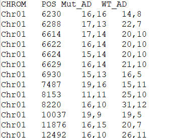

# Read the data.

Pay attention to the correspondence between mutant and wildtype samples, which are located in column 3 (mutant) and column 4 (wt) in this case, respectively.

```{r}
# Read allele depth file
var_file = "usr_sample.AD.table"

raw = read.delim(var_file, header = TRUE, colClasses = c("character", "numeric","character","character"))

# remove positions with no reads in either pool
raw <- raw[!is.na(raw[[3]]) & !is.na(raw[[4]]), ]

# strsplit A,B \t X,Y to A B X Y
wt_col=4
mut_col=3

wt_AD = matrix(as.numeric(unlist(strsplit(raw[, wt_col], ","))), ncol = 2, byrow = TRUE)
mut_AD = matrix(as.numeric(unlist(strsplit(raw[, mut_col], ","))), ncol = 2, byrow = TRUE)

colnames(mut_AD) = colnames(wt_AD) = c("ref_reads", "alt_reads")
TEMP = cbind(raw[, 1:2], mut_AD)
merged_data = cbind(TEMP, wt_AD)

colnames(merged_data) = c("CHROM", "POS","ref_reads_mut", "alt_reads_mut","ref_reads_wt", "alt_reads_wt")
```

Example: the columns of input var_file are " CHR, POS, AD (in mut pool), AD (in wt pool) "

# 

# Calculate allele frequencies

```{r}
# Calculate allele frequency in mut and wt pools
mut_freq = merged_data$alt_reads_mut / (merged_data$ref_reads_mut + merged_data$alt_reads_mut)
wt_freq = merged_data$alt_reads_wt / (merged_data$ref_reads_wt + merged_data$alt_reads_wt)

# mutate 0
mut_freq[mut_freq == 0] <- 1e-6
wt_freq[wt_freq == 0] <- 1e-6

# Calculate LOD
LOD = log10(
    dbinom(merged_data$alt_reads_mut, size = merged_data$alt_reads_mut + merged_data$ref_reads_mut, prob = mut_freq) *
    dbinom(merged_data$alt_reads_wt, size = merged_data$alt_reads_wt + merged_data$ref_reads_wt, prob = wt_freq) /
    (dbinom(merged_data$alt_reads_mut, size = merged_data$alt_reads_mut + merged_data$ref_reads_mut, prob = (mut_freq + wt_freq) / 2) *
    dbinom(merged_data$alt_reads_wt, size = merged_data$alt_reads_wt + merged_data$ref_reads_wt, prob = (mut_freq + wt_freq) / 2))
)

# combine
result_table = cbind(merged_data[, c("CHROM", "POS")],mut_freq,wt_freq, LOD)
```

## Define smooth func

```{r}
# smooth function
smooth_LOD <- function(position, LOD, window_size = 1e6, step_size = 5e5) {
  start_positions <- seq(min(position), max(position) - window_size, by = step_size)
  smoothed_pos <- numeric(length(start_positions))
  smoothed_LOD <- numeric(length(start_positions))
  
  for (i in seq_along(start_positions)) {
    window_start <- start_positions[i]
    window_end <- window_start + window_size
    in_window <- position >= window_start & position <= window_end
    smoothed_pos[i] <- (window_start + window_end) / 2
    smoothed_LOD[i] <- mean(LOD[in_window], na.rm = TRUE)
  }
  
  return(data.frame(POS = smoothed_pos, LOD = smoothed_LOD))
}
```

# plot

SNP ratio of WT-pool (blue) and mutant-pool (red); LOD (black)

```{r}

# plot + export

outdir <- "plots"
dir.create(outdir, showWarnings = FALSE)

for (chr in unique(result_table$CHROM)) {
  
  chr_data <- subset(result_table, CHROM == chr)
  
  smooth_data_mut <- smooth_LOD(chr_data$POS, chr_data$mut_freq)
  smooth_data_wt  <- smooth_LOD(chr_data$POS, chr_data$wt_freq)
  smooth_data_LOD <- smooth_LOD(chr_data$POS, chr_data$LOD)
  
  ############################
  # PDF (Illustrator editable)
  ############################
  pdf(file = file.path(outdir, paste0("Chr_", chr, ".pdf")),
      width = 8, height = 4.5)
  
  
  plot(chr_data$POS / 1e6, chr_data$mut_freq, type = "n",
       xlab = "Position (Mb)", ylab = "Allele frequency",
       main = paste("Chromosome", chr),
       ylim = c(0, 1))
  
  lines(smooth_data_mut$POS / 1e6, smooth_data_mut$LOD, col = "red",  lwd = 2)
  lines(smooth_data_wt$POS  / 1e6, smooth_data_wt$LOD,  col = "blue", lwd = 2)
  
  par(new = TRUE)
  
  plot(chr_data$POS / 1e6, chr_data$LOD, type = "n",
       axes = FALSE, xlab = "", ylab = "", ylim = c(-2, 15))
  
  lines(smooth_data_LOD$POS / 1e6, smooth_data_LOD$LOD,
        col = "black", lwd = 2)
  
  axis(side = 4, at = seq(0, 15, by = 3), labels = seq(0, 15, by = 3))
  mtext("LOD score", side = 4, line = 2.5)
  
  abline(h = 3, col = "black", lwd = 1.5, lty = 2)
  
  legend("topleft",
         legend = c("Mut pool (red)", "WT pool (blue)", "LOD (black)"),
         col = c("red", "blue", "black"), lwd = 2, bty = "n")
  
  dev.off()
  
  ############################
  # TIFF (publication)
  ############################
  
  tiff(file = file.path(outdir, paste0("Chr_", chr, ".tiff")),
       width = 2000, height = 1200, res = 300, compression = "lzw")
  

  
  plot(chr_data$POS / 1e6, chr_data$mut_freq, type = "n",
       xlab = "Position (Mb)", ylab = "Allele frequency",
       main = paste("Chromosome", chr),
       ylim = c(0, 1))
  
  lines(smooth_data_mut$POS / 1e6, smooth_data_mut$LOD, col = "red",  lwd = 2)
  lines(smooth_data_wt$POS  / 1e6, smooth_data_wt$LOD,  col = "blue", lwd = 2)
  
  par(new = TRUE)
  
  plot(chr_data$POS / 1e6, chr_data$LOD, type = "n",
       axes = FALSE, xlab = "", ylab = "", ylim = c(-2, 15))
  
  lines(smooth_data_LOD$POS / 1e6, smooth_data_LOD$LOD,
        col = "black", lwd = 2)
  
  axis(side = 4, at = seq(0, 15, by = 3), labels = seq(0, 15, by = 3))
  mtext("LOD score", side = 4, line = 2.5)
  
  abline(h = 3, col = "black", lwd = 1.5, lty = 2)
  
  legend("topleft",
         legend = c("Mut pool (red)", "WT pool (blue)", "LOD (black)"),
         col = c("red", "blue", "black"), lwd = 2, bty = "n")
  
  dev.off()
}

```
